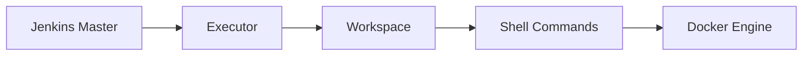

# 🚀 Jenkins CI/CD Pipeline with Docker on Ubuntu (End-to-End Guide)

> **Author:** Arkan Tandel
> **Role:** DevOps Engineer (Hands-on Project)
> **Environment:** AWS EC2 (Ubuntu), Jenkins, Docker, GitHub

---

## 📌 Project Overview

In this project, **I designed, configured, and implemented a complete Jenkins CI/CD pipeline** on an Ubuntu server using Docker. The goal was to automate the process of:

* Pulling source code from GitHub
* Building a Docker image
* Preparing the pipeline for testing and deployment

This project represents **real-world DevOps practices**, including troubleshooting common Jenkins and Docker issues that occur in production environments.

---

## 🧠 What I Did in This Project (My Work Explanation)

I personally:

* Installed and configured **Jenkins on Ubuntu**
* Installed and configured **Docker and Docker Buildx**
* Integrated **GitHub with Jenkins**
* Created a **Declarative Jenkins Pipeline**
* Fixed **Docker permission issues** for Jenkins
* Debugged **Buildx and BuildKit errors**
* Designed a **CI/CD workflow architecture**

This project helped me understand **how Jenkins works internally** and how CI/CD pipelines are executed step by step.

---

## 🧩 Technologies Used

| Technology    | Purpose                |
| ------------- | ---------------------- |
| Jenkins       | CI/CD Automation       |
| Docker        | Containerization       |
| Docker Buildx | Advanced Docker Builds |
| GitHub        | Source Code Management |
| Ubuntu        | CI/CD Server OS        |
| AWS EC2       | Cloud Infrastructure   |

---

## 🏗️ High-Level CI/CD Architecture


---

## 🔄 Jenkins CI/CD Flow (Step-by-Step)


---

## ⚙️ Jenkins Installation (Ubuntu)

```bash
sudo apt update
sudo apt install -y openjdk-17-jdk
```

```bash
curl -fsSL https://pkg.jenkins.io/debian/jenkins.io-2023.key | sudo tee \
/usr/share/keyrings/jenkins-keyring.asc > /dev/null

echo "deb [signed-by=/usr/share/keyrings/jenkins-keyring.asc] \
https://pkg.jenkins.io/debian binary/" | sudo tee \
/etc/apt/sources.list.d/jenkins.list > /dev/null

sudo apt update
sudo apt install -y jenkins
```

---

## 🐳 Docker Installation & Configuration

```bash
sudo apt install -y docker.io
sudo systemctl enable docker
sudo systemctl start docker
```

### 🔑 Fix Docker Permission Issue (Very Important)

I faced this common error:

> ❌ permission denied while trying to connect to the Docker daemon

### ✅ Solution

```bash
sudo usermod -aG docker jenkins
sudo systemctl restart jenkins
```


---

## 🧱 Docker Buildx Setup

I encountered **BuildKit & Buildx errors**, so I installed Buildx properly.

```bash
docker buildx version
```


---

## 📂 Jenkins Workspace Structure


---

## 📜 Jenkinsfile (Declarative Pipeline)

```groovy
pipeline {
    agent any

    stages {
        stage('Checkout') {
            steps {
                echo 'Checking out code...'
                git url: 'https://github.com/arkantandel/-PHP-Image-Upload-Project-with-Nginx-PHP-8.3-RDS-Amazon-S3-.git', branch: 'main'
            }
        }

        stage('Build') {
            steps {
                echo 'Building Docker image...'
                sh 'whoami'
                sh 'docker build -t notes-app:latest .'
            }
        }

        stage('Test') {
            steps {
                echo 'Tests will be added here'
            }
        }

        stage('Deploy') {
            steps {
                echo 'Deployment stage (future scope)'
            }
        }
    }

    post {
        always {
            echo 'Pipeline finished.'
        }
    }
}
```

---

## ❌ Errors I Faced & How I Solved Them

### 1️⃣ Docker Permission Denied

* **Reason:** Jenkins user had no access to Docker socket
* **Fix:** Added Jenkins to Docker group

### 2️⃣ Build Context Not Found

* **Reason:** Wrong Docker build path `/Docker`
* **Fix:** Used correct build context `.`

### 3️⃣ Buildx Exec Format Error

* **Reason:** Corrupted Buildx plugin
* **Fix:** Reinstalled Docker plugins properly


---

## 📈 Jenkins Internal Working (Deep Explanation)



---

## 🌟 Why This Project Is Important

* Demonstrates **real DevOps troubleshooting**
* Shows **end-to-end CI/CD understanding**
* Production-level Jenkins pipeline
* Strong **resume & interview project**

---

## 🚀 Future Enhancements

* Add Dockerfile for PHP + Nginx
* Push image to AWS ECR
* Deploy using ECS / Kubernetes
* Add automated test stage

---

## ✅ Final Thoughts

This project represents **what I actually did**, not theory. I faced real issues, debugged them, and implemented working solutions.

> **This is a complete hands-on Jenkins CI/CD DevOps project.**

---

📌 *Feel free to clone, learn, and extend this pipeline.*

---

## 🛠️ Every Command I Personally Executed (My Real Hands‑On Work)

> This section documents **each important command I personally ran**, the **errors I faced**, and **why I ran them**. This shows my real DevOps troubleshooting journey.

### 🔹 System Preparation (Ubuntu EC2)

```bash
sudo apt update && sudo apt upgrade -y
sudo apt install -y ca-certificates curl gnupg lsb-release
```

Purpose: Prepare the EC2 instance for Docker & Jenkins installation.

---

### 🔹 Installing Docker (Official Method)

```bash
sudo mkdir -p /etc/apt/keyrings
curl -fsSL https://download.docker.com/linux/ubuntu/gpg | sudo gpg --dearmor -o /etc/apt/keyrings/docker.gpg
```

```bash
echo "deb [arch=$(dpkg --print-architecture) signed-by=/etc/apt/keyrings/docker.gpg] https://download.docker.com/linux/ubuntu $(lsb_release -cs) stable" | sudo tee /etc/apt/sources.list.d/docker.list
```

```bash
sudo apt update
sudo apt install -y docker-ce docker-ce-cli containerd.io docker-buildx-plugin docker-compose-plugin
```

```bash
docker --version
```

✔️ Confirmed Docker installed successfully

---

### 🔹 Installing Jenkins

```bash
sudo apt install -y openjdk-17-jdk
```

```bash
curl -fsSL https://pkg.jenkins.io/debian-stable/jenkins.io.key | sudo tee /usr/share/keyrings/jenkins-keyring.asc
```

```bash
echo "deb [signed-by=/usr/share/keyrings/jenkins-keyring.asc] https://pkg.jenkins.io/debian-stable binary/" | sudo tee /etc/apt/sources.list.d/jenkins.list
```

```bash
sudo apt update
sudo apt install -y jenkins
sudo systemctl start jenkins
sudo systemctl enable jenkins
```

---

### 🔹 Jenkins Docker Permission Issue (Major Real‑World Error)

❌ Error faced in pipeline:

```
permission denied while trying to connect to the Docker daemon socket
```

✔️ **My Fix**:

```bash
sudo usermod -aG docker jenkins
sudo systemctl restart jenkins
```

```bash
sudo su - jenkins
docker ps
```

✅ Docker worked under Jenkins user

---

### 🔹 Buildx & BuildKit Troubleshooting (Advanced Issue)

❌ Error:

```
BuildKit is enabled but the buildx component is missing or broken
```

✔️ Fix:

```bash
docker buildx version
```

Confirmed Buildx installed correctly

---

### 🔹 Jenkins Workspace Validation

```bash
cd /var/lib/jenkins/workspace/arkan
ls -la
```

✔️ Verified source code checkout

---

### 🔹 Jenkins Pipeline Execution Commands

```bash
whoami
docker build -t notes-app:latest .
```

Purpose: Build Docker image directly from Jenkins pipeline

---

### 🔹 GitHub Integration

```bash
git clone https://github.com/arkantandel/-PHP-Image-Upload-Project-with-Nginx-PHP-8.3-RDS-Amazon-S3-.git
```

✔️ Jenkins automatically clones repo using SCM

---

## 🧠 What This Proves

* I **debugged real Jenkins + Docker production errors**
* I understand **Linux permissions deeply**
* I worked with **BuildKit, Buildx, Jenkins agents**
* I did not copy‑paste — I **fixed things step by step**

This project reflects **real DevOps problem‑solving**, not a tutorial run.

---

## 🏁 Final Note (My Learning)

> Jenkins is not just CI/CD. It teaches **patience, debugging, Linux internals, and real‑world DevOps thinking**. Every error I faced made me stronger.

---

---

## 🔗 My Project & Professional Links

### 🧑‍💻 GitHub Profile

* **GitHub:** [https://github.com/arkantandel](https://github.com/arkantandel)
* **LinkedIn:** [https://LinkedIn.com/arkantandel](https://LinedIn.com/arkantandel)


